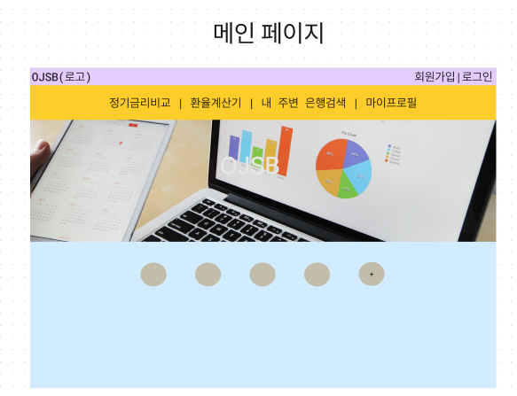
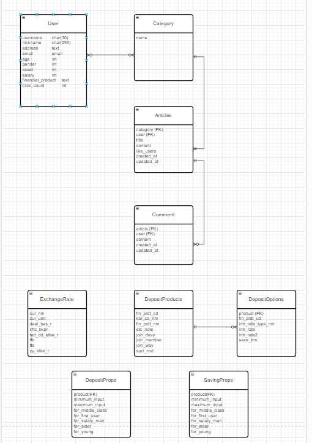
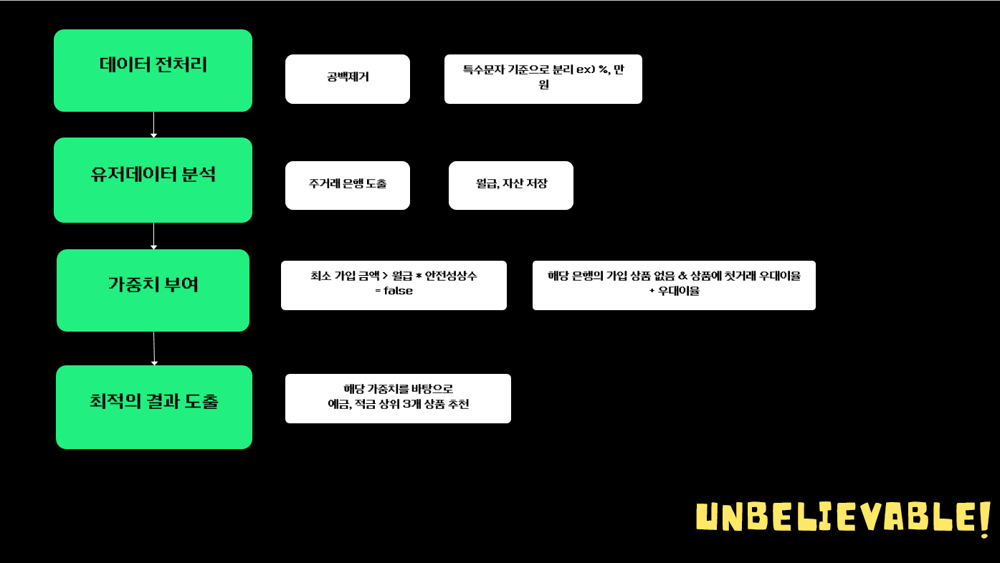

# Final Project - 이운재 , 김상범

## 금융 프로젝트
- 금융API, 환율API, 지도API를 이용한 환율비교, 정기예금비교, 은행위치알기
- 게시판 및 회원가입/로그인 기능까지 !!

## 인덱스
1. 팀원 소개
2. 사용한 기술 스택
3. 설계 내용 및 구현정도
4. 데이터베이스 모델링 (ERD)
5. 금융 상품 추천 알고리즘
6. 대표 기능
7. 기타

## 1. 팀원 및 업무분담
- 팀장: 이운재 - 회원가입, 로그인/로그아웃, 게시판, 프로필, 추천알고리즘
- 팀원: 김상범 - 환율비교, 금융상품비교, 추천알고리즘

## 2. 사용한 기술 스택
### 백엔드
- Python
- Django
- Celery
- Redis

### 프론트엔드
- JavaScript
- Vue.js
- Vuetify
- Bootstrap

## 3. 설계 내용 및 구현정도
- 
- 추가로, 카카오맵API, 추천 알고리즘
### 구현정도
- 게시판 : CRUD 구현 완성 및 로그인 사용자에 대한 핸들링
- 프로필 : 개인 프로필 정보 나타내기 및 가입한 상품에대한 상세정보 제공
- 금융상품비교 : API로 받아온 정보들을 나열하며 클릭시, 상세정보 제공
- 은행검색 : API로 받아온 지도를 나타내며, 주변 은행 검색 가능
- 환율계산기: 두 나라를 선택해 환율계산 가능, 최대 3개월간 원화 대비 각 나라의 환율 파악 가능
- 회원가입/로그인 : dj-rest-auth를 통해 구현, 회원가입, 회원정보수정, 로그인, 로그아웃 구현

## 4. 데이터베이스 모델링

## 5. 추천알고리즘 설명
- 큰틀 : 데이터 전처리 - 가중치부여 - 최적의결과도출

### 데이터 전처리
- 금융 상품 설명란에서 공백을 제거하고 , 특수문자 기준으로 분리후 원하는 정보를 뽑아냅니다.(ex:최저 가입금액 등)
### 유저데이터 분석 및 가중치 부여
- 만약에 최소가입 금액이 월급*안전성상수 보다 크면  false를 리턴해 상품 목록을 추려 냅니다. 추가로 해당 은행의 가입 상품이 없고 상품설명에 첫 거래시 우대한다는 말이 있을시 가중치르 부여해줍니다.
### 최적의 결과 도출
- 해당 가중치를 바탕으로 예금,적금 상위 3개 상품을 추천해 줍니다.
## 6. 대표 기능
- 회원가입 : 아이디 및 패스워드 및 금융 상품 추천 알고리즘을 위한 추가 정보란을 더 추가 했으나, 아이디 및 패스워드를 제외한 정보란은 필수 요구란이 아닙니다. dj-rest-auth 를 이용해 구현했습니다.

- 로그인: 마찬가지로 dj-rest-auth를 통해 구현했으며, 로그인 성공시 홈으로 가는 라우터를 추가했습니다.

- 게시판 : CRUD 기능을 모두 구현했으며, 로그인 한 사용자만 이용할 수 있고, 자기의 글 및 댓글만 수정 및 삭제가 가능합니다.

- 금융상품 비교 , 환율 비교 : 금감원 API, 한국 수출입 은행 API를 이용해 정보를 받아와서 구현했으며, 금융상품의 경우 최대 36개월 기간 까지 그래프로 상품들을 비교 할 수 있습니다. 환율은 한 나라 기준 다른 나라는 얼마인지 비교가 가능하며, 최근 3개월간의 각 나라의 환율 변동을 알려줍니다.

- 내 주변 은행 검색: 카카오맵 API를 이용해서 집주변 은행 및 장소를 검색하면 주변 은행을 알 수 있습니다.

- 상품 추천: 알고리즘을 이용해 사용자에게 맞는 상품을 추천합니다.

## 7. 기타 (느낀점 및 후기)
### 느낀점
- 백엔드 + 프론트엔드를 종합적으로 고려하면서 하려고 하니까 생각보다 많이 어려운 작업이였습니다. 
- 그리고 단순히 배운거만 쓰면 되지 않을까라는 생각은 옳지 않았습니다.
- 원하는것을 구현하기 위해 추가적으로 필요한 지식이 많았으며, 기능이 추가될때 마다 유기적으로 연결시키는게 많이 어려웠습니다.
- 공식문서를 잘 읽고 이해하는 연습이 많이 필요하다는 것을 뼈저리게 느꼈습니다.
- 제출을 하고 나서 생각은 했지만 구현하지 못한 기능을 구현하고 싶습니다.
### 후기
- 우리 조는 협업에 관해서는 어려움이 없었습니다.
- 각자 자기가 맡은 기능을 구현했으며, 어려운점이 있을 때는 서로에게 물어보고 해결해주는 자세를 갖춘 채 프로젝트를 했습니다.
- 서툴지만, 프로젝트에 관한 틀을 알게된 경험이였습니다
- 이 경험이 기억에서 형태가 희미해 지기전에, 개인 프로젝트로 다른 웹을 만들어 보거나, 이 프로젝트를 유지 보수 및 업데이트를 하고 싶습니다.
- 1주일 동안 힘들었지만, 기능이 하나하나 완성 될 때 마다 많이 뿌듯 했습니다. 